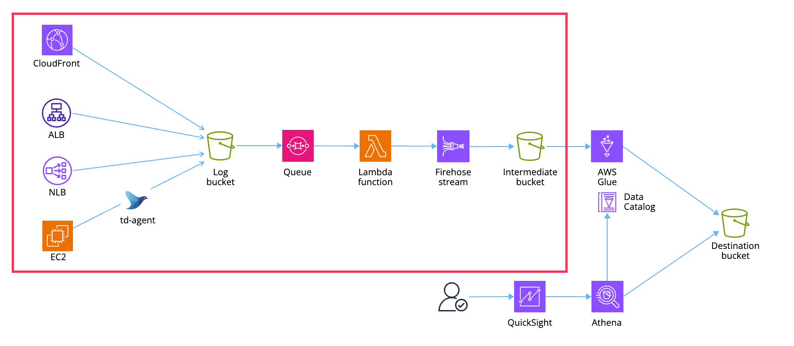

cdk-log-aggregator
==================

Sample CDK application that configures the access log collection system on AWS.

Diagram
-------



Supported
---------

- CloudFront
- ALB
- NLB
- EC2 (httpd logs via td-agent)

Prerequisites
-------------

First, define the context as follows:

```json
{
  ...
  "context": {
    ...
    "owner": "user",
    "serviceName": "myapp",
    "hostedZoneName": "your-domain.com"
  }
}
```

Usage
-----

Deploy resources with the following command:

```sh
npx cdk synth
npx cdk deploy
```
